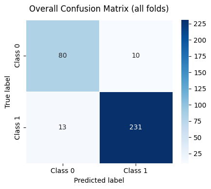
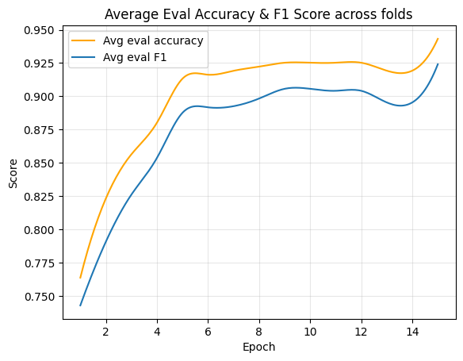

# Explainable Early Detection of Diabetic Foot Ulcers Using Thermal Imaging with Vision Transformers and Grad-CAM

[Huggingface space](https://huggingface.co/spaces/pichaaa1808/Explainable-DFU-ViT) | [Dataset](https://ieee-dataport.org/open-access/plantar-thermogram-database-study-diabetic-foot-complications) 

## Model Performance

The following table shows the performance metrics (Mean ± Std) across folds for the Vision Transformer (ViT) and Data-efficient Image Transformer (DeiT) models.

| Model | Accuracy | Precision | Recall | F1 Score |
| :--- | :---: | :---: | :---: | :---: |
| **ViT** | 0.9193 ± 0.0489 | 0.9416 ± 0.0493 | 0.9508 ± 0.0471 | 0.9452 ± 0.0330 |
| **DeiT** | 0.9221 ± 0.0387 | 0.9541 ± 0.0180 | 0.9385 ± 0.0456 | 0.9459 ± 0.0277 |

## Visualizations

### Confusion Matrix
Comparison of classification performance between ViT and DeiT.

| Vision Transformer (ViT) | Data-efficient Image Transformer (DeiT) |
| :---: | :---: |
|  |  |

### Training History
Average Accuracy and F1 Score across training epochs.

| Vision Transformer (ViT) | Data-efficient Image Transformer (DeiT) |
| :---: | :---: |
|  |  |

